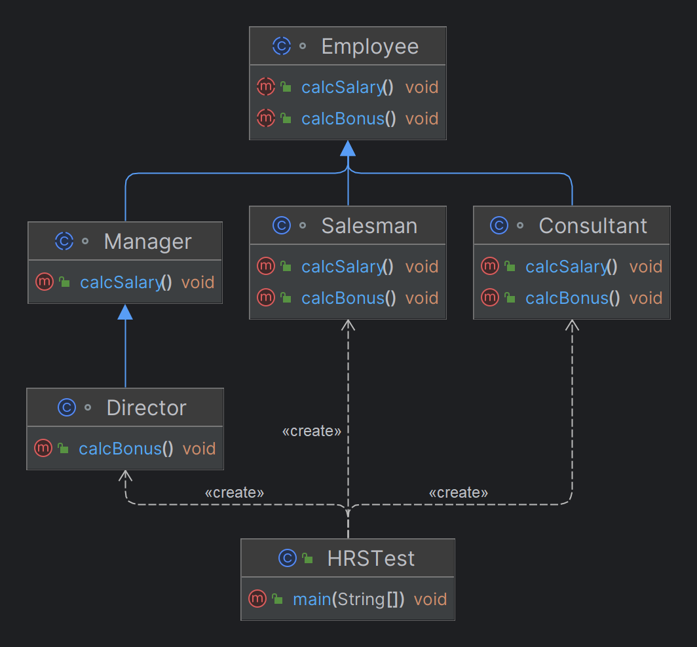

# 추상 Abstract

>1. 사물이나 개념에서 공통되는 특성이나 속성 따위를 추출하는 것
>2. 메서드의 이름, 매개변수, 리턴타입 등 공통 특성만 작성하고 본문(구현내용) 생략
>3. 추상메서드 사용 시 클래스도 추상 선언 필요
>4. 추상 클래스 상속 시 추상 메서드를 오버라이딩 하여 본문 구현

<table>
<tr>
<td>

```java
// method abstract 선언하여 같이 abstract 선언
abstract class Employee {
    String name;
    int salary;

    // method abstract 선언
    public abstract void calcSalary();
    public abstract void calcBonus();
}

class Salesman extends Employee {
    public void calcSalary(){
        System.out.println("Salesman 급여 = 기본급 + 판매 수당");
    }

    // Director 에서 사용하기 위해 Employee 에서 선언 시
    // 상속받는 자식들도 모두 메서드 오버라이딩
    @Override
    public void calcBonus() {
        
    }
}

class Consultant extends Employee{
    public void calcSalary(){
        System.out.println("Consultant 급여 = 기본급 + 컨설팅 특별 수당");
    }

    @Override
    public void calcBonus() {
        
    }
}

// abstract 선언하여 calcBonus Method를 Override 하지 않음
abstract class Manager extends Employee {
    public void calcSalary(){
        System.out.println("Manager 급여 = 기본급 + 팀 성과 수당");
    }
}

// Manager를 상속하여 Manager도 abstract 선언
// -> Manager가 abstract 클래스를 상속하기 때문
class Director extends Manager {
    public void calcBonus(){
        System.out.println("Director 보너스 = 기본급 * 12 * 6");
    }
}

public class HRSTest {
    public static void main(String[] args){
        Salesman s = new Salesman();
        Consultant c = new Consultant();
        // Manager m = new Manager(); -> 추상화하여 인스턴스 사용 불가
        Director d = new Director();

        s.calcSalary();
        c.calcSalary();
        // m.calcSalary();
        d.calcBonus();
    }
}
```

</td>
<td>



</td>
</tr>
</table>

