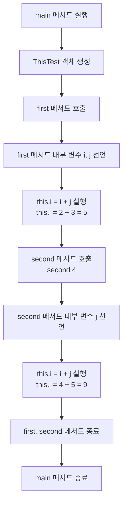
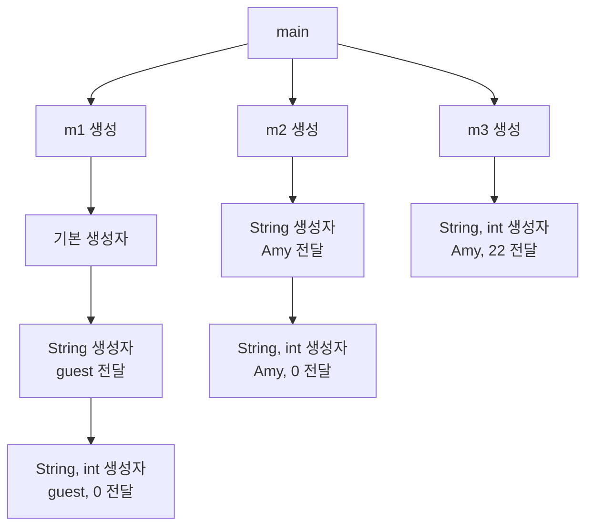

# 클래스 Class

```Java
// package
package com.company.project.toppackage.lowerpackage;

// class import
import com.company.project.toppackage.lowerpackage.Armor;
import java.io.*;

// class
public class Armor {
    // field
    public String name;
    private int height;
    protected int weight;
    String color; // default
    private boolean isFly;

    // method
    void land() {
    }

    public boolean takeOff() {
        System.out.println("Take on!");
        System.out.println("Take off!");
        return true;
    }
    
    // parameter (매개 변수)
    void launchMissile(int value) {
        int missile = value;
    }
    
    // method overloading
    void launchMissile(int value, int value_speed) {
        int missile = value;
        int missileSpeed = value_speed;
    }
    
    // varargs (가변 길이 인자)
    void shootLaser(int... values) {
        System.out.print(values.length + " Laser:");
        for (int i = 0; i < values.length; i++) {
            System.out.print(" " + values[i]);
        }
        System.out.println();
    }
    
    // 복합 선언
    void pilot(String name, int ...values) {
        System.out.println("Pilot: " + name);
        for (int i = 0; i < values.length; i++) {
            System.out.println("Value: " + values[i]);
        }
    }
    
    // getter
    public boolean getIsFly() {
        return isFly;
    }
    
    // setter
    public void setIsFly(boolean isFly) {
        this.isFly = isFly;
    }

    public static void main(String[] args) {
        // 코드
        System.out.println("Hello World");
        // 메서드 호출
        takeOff();
        lanchMissile(3);
        lanchMissile(3, 100);
        shortLaser(1, 2, 3, 4, 5);
        shortLaser(1, 2, 3);
        pilot("Tom", 1, 3, 7, 9, 11);
        
        // instance
        Armor fly = new Armor();
        fly.setIsFly(true);
        System.out.println(fly.getIsFly());
    }
}
```

# 정적 멤버 선언 Static Member Declaration

|구분|메모리 할당 시점|메모리 할당 위치|메모리 해제 시점|
|-|-|-|-|
|인스턴스 필드|인스턴스 생성 시|힙 메모리|인스턴스 소멸 시|
|클래스 필드|프로그램 시작 시|코드 메모리|프로그램 종료 시|

```Java
class Count {
    public static int totalCount;
    int count;
}

public class CountTest {
    public static void main(String[] args) {
        System.out.println("실행 시작");
        Count c1 = new Count();
        Count c2 = new Count();
        Count c3 = new Count();
        
        // instance field -> 서로 같은 변수를 사용하지만 독립적
        c1.count++;
        c2.count++;
        c3.count++;
        
        // class field -> 메모리에 할당된 값을 모든 인스턴스가 공유
        Count.totalCount++;
        Count.totalCount++;
        Count.totalCount++;
        
        // 모든 출력 결과가 3 : 1
        System.out.println(Count.totalCount + " : " + c1.count);
        System.out.println(Count.totalCount + " : " + c2.count);
        System.out.println(Count.totalCount + " : " + c3.count);
    }
}
```

# 클래스 메서드 Class Method

>static 키워드 선언 시 main() method 실행 전 코드 메모리 영역에서 생성되어 사용 준비 완료

```Java
public class StaticMethodTest {
    
    // static code block -> static 선언한 class field 초기화하거나 프로그램 실행 시 먼저 처리해야 하는 작업 작성
    static {
        System.out.println("first");
    }
    
    // instance field
    int num = 123;
    
    public static void main(String[] args) {
        
        // class method 호출
        StaticMethodTest.print1();
        
        // instance method 호출 -> 인스턴스 생성 후 참조 정보 저장
        StaticMethodTest exam = new StaticMethodTest();
        exam.print2();
    }

    // class method
    public static void print1() {
        
        // 호출 불가
        int num2 = num; // 오류 발생

        System.out.println("class");
    }

    // instance method
    public void print2() {
        
        // 호출 가능
        int num3 = num;

        System.out.println("instance");
    }
}
```

# 생성자 Constructor

>1. instance 생성 시 자동 호출
>2. return value 없음
>3. 소속된 class 이름과 같음 -> 일반 method와 다르게 대문자로 시작
>4. field 초기화를 담당

```Java
public class Member {
    private String name;
    private int age;
    
    // constructor
    public Member() {
    }
    
    // overloading 가능
    public Member(String name) {
    }
    
    public void setName(String name) {
        
    }
    
    public static void main(String[] args) {
        // constructor 호출
        new Member();
        new Member("Amy");
    }
}
```

# 자신을 가리키는 키워드 this

>1. class의 member를 가리킬 때
>2. constructor를 호출할 때
>3. 자신의 address value를 전달하고 싶을 때

<table>
<tr>
<td>

```Java
public class ThisTest {
    // this 의 대상
    int i = 1;

    public void first() {
        int i = 2;
        int j = 3;
        this.i = i + j;

        second(4);
    }

    public void second(int i) {
        int j = 5;
        this.i = i + j;
    }

    public static void main(String[] args){
        ThisTest exam = new ThisTest();
        exam.first();
        System.out.println(exam.i); // int i 는 9를 가지게 된다
    }
}
}
```

</td>
<td>



</td>
</tr>
</table>

# 생성자 호출

<table>
<tr>
<td>

```Java
public class Member {
    private String name;
    private int age;
    
    public Member() {
        this("guest");
    }
    
    public Member(String name) {
        this(name, 0);
    }
    
    public Member(String name, int age) {
        this.name = name;
        this.age = age;
    }
    
    public static void main(String[] args) {
        Member m1 = new Member();
        Member m2 = new Member("Amy");
        Member m3 = new Member("Amy", 22);
    }
}
```

</td>
<td>



</td>
</tr>
</table>
