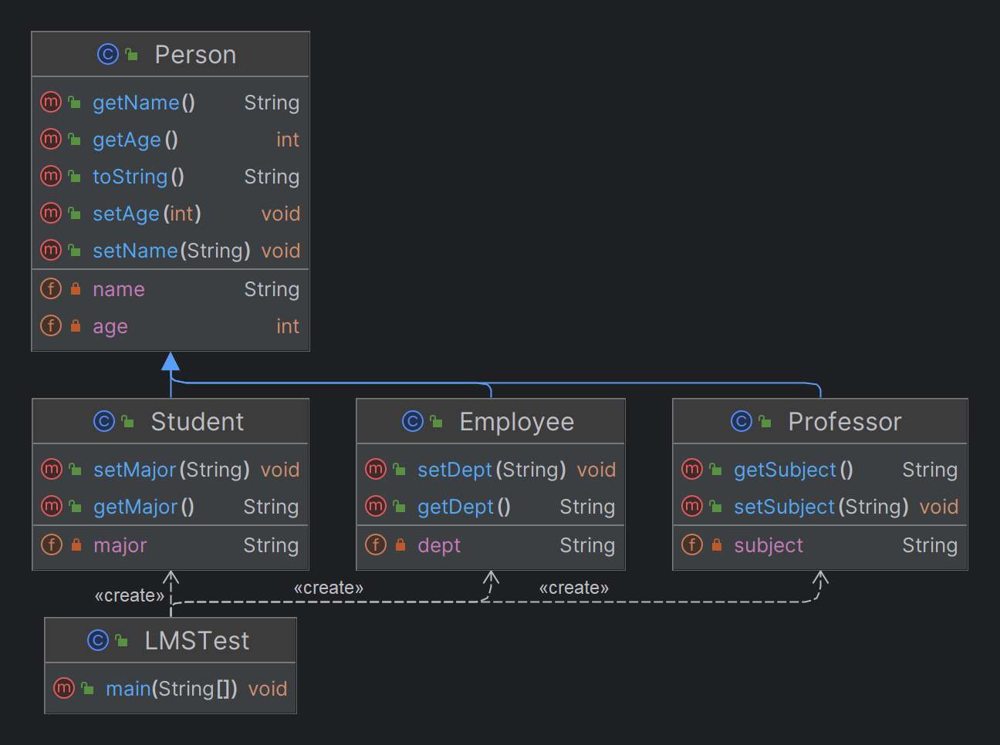

# 상속 Inheritance

> 1. 클래스 중복 필드와 메서드 제거 -> 공통점을 새로운 클래스로
> 2. single inheritance만 가능
> 3. 코드의 재사용성 증가 -> 개발 생산성 증가

<table>
<tr>
<td>

```Java
// 부모 클래스
public class Person {
    private String name;
    private int age;

    public Person() {

    }
    
    // 부모 생성자 활용 -> 중복 제거
    public Person(String name, int age) {
        this.name = name;
        this.age = age;
    }
    
    public String getName(){
        return name;
    }
    
    public void setName(String name) {
        this.name = name;
    }
    
    public int getAge() {
        return age;
    }
    
    public void setAge(int age) {
        this.age = age;
    }
    
    @Override
    public String toString() {
        return "Person{" +
                "name='" + name + '\'' +
                ", age=" + age +
                '}';
    }
}
```
```Java
// 테스트
public class LMSTest {
    public static void main(String[] args) {
        Employee e = new Employee();
        Professor p = new Professor();
        Student s = new Student();

        e.setName("오정임");
        e.setAge(47);
        e.setDept("입학처");

        p.setName("김푸름");
        p.setAge(52);
        p.setSubject("빅데이터");

        s.setName("김유빈");
        s.setAge(20);
        s.setMajor("컴퓨터과학");

        System.out.println(e);
        System.out.println(p);
        System.out.println(s);
        
        // constructor overloading
        Employee e2 = new Employee("김성호", 45, "사무처");
        Professor p2 = new Professor("이수연", 37, "정보보안");
        Student s2 = new Student("박수진", 23, "AI공학");

        System.out.println(e2);
        System.out.println(p2);
        System.out.println(s2);
    }
}
```



</td>
<td>

```Java
// 자식 클래스 1
public class Student extends Person { // Person class를 상속
    
    // 상속 시 생성자 첫 줄에 super() 자동 생성
    // 자식 클래스 인스턴스 생성 시 부모 클래스 생성자도 함께 호출
    public Student() {
        super();
    }
    // constructor overloading
    public Student(String name, int age, String major) {
        // super.setName(name)대신 부모 생성자 호출
        super(name, age);
        this.major = major;
    }
    
    private String major;

    public String getMajor() {
        return major;
    }

    public void setMajor(String major) {
        this.major = major;
    }
    // 부모 클래스의 method 호출
    @Override
    public String toString() {
        return "Student{" +
                "major='" + major + '\'' +
                "} " + super.toString();
        // this.getName()을 사용해 method Overriding 가능
    }
}
```
```Java
// 자식 클래스 2
public class Employee extends Person {

    public Employee() {
        super();
    }

    public Employee(String name, int age, String dept) {
        super(name, age);
        this.dept = dept;
    }
    
    private String dept;

    public String getDept() {
        return dept;
    }

    public void setDept(String dept) {
        this.dept = dept;
    }
    
    @Override
    public String toString() {
        return "Employee{" +
                "dept='" + dept + '\'' +
                "} " + super.toString();
    }
}
```
```Java
// 자식 클래스 3
public class Professor extends Person {

    public Professor() {
        super();
    }

    public Professor(String name, int age, String subject) {
        super(name, age);
        this.subject = subject;
    }
    
    private String subject;

    public String getSubject() {
        return subject;
    }

    public void setSubject(String subject) {
        this.subject = subject;
    }
    
    @Override
    public String toString() {
        return "Professor{" +
                "subject='" + subject + '\'' +
                "} " + super.toString();
    }
}
```

</td>
</tr>
</table>

# final 제어자

>1. 초깃값을 변경하지 않고 그대로 사용하기 위해
>2. 파이(원주율)와 같은 수학적 값을 사용하기 위해
>3. 주민번호, 학번과 같은 유일한 값을 사용하기 위해
>4. 이름을 대문자로 사용
>5. 메서드 오버라이딩 제한 & 클래스 상속 제한

<table>
<tr>
<td>
사용 불가
</td>
<td>
사용 가능
</td>
</tr>
<tr>
<td>

```Java
public class Person {
    private final String ssn_ID;
    
    // 생성자에서 초기화 하지 않음
    public Person(){
        
    }
    
    public void setSsn_ID(String ssn_ID){
        // 변경 불가능한 값을 수정시도
        this.ssn_ID2 = ssn_ID;
    }
}
```

</td>
<td>

```Java
public class Person {
    // 초깃값을 선언 후 사용
    private final String ssn_ID = "156-879";
    private final String ssn_ID2;
    
    // 생성자에서 초기화 후 사용
    public Person(String ssn_ID2){
        this.ssn_ID2 = ssn_ID2;
    }
}
```

</td>
</tr>
</table>