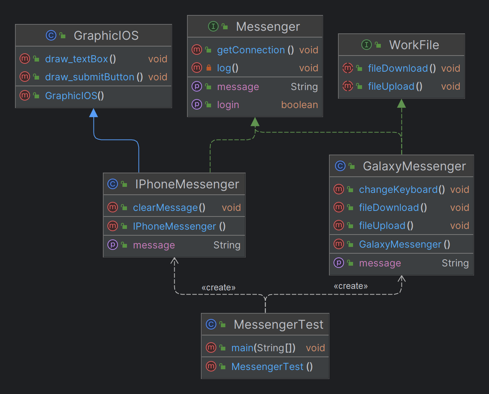

# Interface

> **여러 프로그램에서 사용할 멤버(변수, 메서드)를 일관되게 하기 위한 기술 명세**
> 1. 기능별로 클래스를 정함
> 2. 기능별로 메서드의 선언부를 정함
> 3. 기능별로 변수를 정함
> 4. 별도의 선언 없어도 메서드에 제어자(public, abstract) 자동 추가
> 5. 별도의 선언 없어도 필드에 제어자(public, static, final) 자동 추가
> 6. default 메서드를 통해 private 선언한 본문 구현 가능
 
```Java
public interface Messenger {
    // public static final 생략 시 자동 선언
    public static final int MIN_SIZE = 1;
    public static final int MAX_SIZE = 100;

    // public abstract 생략 시 자동 선언
    public abstract String getMessage();

    public abstract void setMessage(String message);

    // default 를 통한 본문 구현
    public default void setLogin(boolean login) {
        if(login)
            System.out.println("Login: true");
        else
            System.out.println("Login: false");
    }

    // public default 생략 시 자동 선언
    public static void getConnection(){
        // static 메서드 내에서 다른 메서드를 사용하려면 같은 static 메서드이어야 함
        log();
        System.out.println("Connection: true");
    }

    // default 를 통한 private 메서드
    private static void log(){
        System.out.println("Logging...");
    }
}

```

# 인터페이스 상속 Interface Inheritance

<table>
<tr>
<td>

```Java
public interface Messenger {
// public static final 생략 시 자동 선언
public static final int MIN_SIZE = 1;
public static final int MAX_SIZE = 100;

    // public abstract 생략 시 자동 선언
    public abstract String getMessage();

    public abstract void setMessage(String message);

    // default 를 통한 본문 구현
    public default void setLogin(boolean login) {
        if(login)
            System.out.println("Login: true");
        else
            System.out.println("Login: false");
    }

    // default 생략 시 자동 선언
    public static void getConnection(){
        // static 메서드 내에서 다른 메서드를 사용하려면
        // 같은 static 메서드이어야 함
        log();
        System.out.println("Connection: true");
    }

    // default 를 통한 private 메서드
    private static void log(){
        System.out.println("Logging...");
    }
}
```

</td>
<td>

```Java
public class MessengerTest {
public static void main(String[] args) {
IPhoneMessenger iphone = new IPhoneMessenger();
GalaxyMessenger galaxy = new GalaxyMessenger();

        System.out.println("메신저 최소 문자 크기" + Messenger.MIN_SIZE);
        System.out.println("메신저 최대 문자 크기" + Messenger.MAX_SIZE);

        iphone.setLogin(true);
        iphone.getMessage();
        iphone.setMessage("hello");
        iphone.clearMessage();

        iphone.draw_textBox();
        iphone.draw_submitButton();

        galaxy.setLogin(true);
        galaxy.getMessage();
        galaxy.setMessage("hi");
        galaxy.changeKeyboard();

        galaxy.fileDownload();
        galaxy.fileUpload();
    }
}
```

</td>
</tr>
<tr>
<td>

```java
// 다중 상속
public class GalaxyMessenger implements Messenger, WorkFile {
    public String getMessage() {
        return "galaxy";
    }

    public void setMessage(String msg) {
        System.out.println("galaxy에서 메시지 설정 : " + msg);
    }

    public void changeKeyboard() {
        System.out.println("키보드아이콘 터치 후 키보드를 변경");
    }

    public void fileDownload(){
        System.out.println("file download");
    }
    public void fileUpload(){
        System.out.println("file upload");
    }
}
```

</td>
<td>

```java
// 복합 상속
public class IPhoneMessenger extends GraphicIOS implements Messenger {

    public String getMessage() {
        return "iPhone";
    }

    public void setMessage(String msg) {
        System.out.println("iPhone에서 메세지 설정: " + msg);
    }

    public void clearMessage() {
        System.out.println("좌우로 흔들어 문자열을 지움");
    }
}
```

</td>
</tr>
<tr>
<td>

```java
public interface WorkFile {
    //public 생략 가능
    public void fileUpload();
    public void fileDownload();
}
```

</td>
<td>

```java
public class GraphicIOS {
    public void draw_textBox(){
        System.out.println("draw text box");
    }
    public void draw_submitButton(){
        System.out.println("draw submit button");
    }
}
```

</td>
</tr>
</table>

